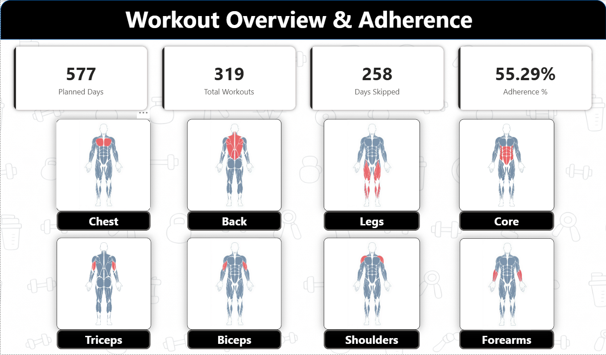
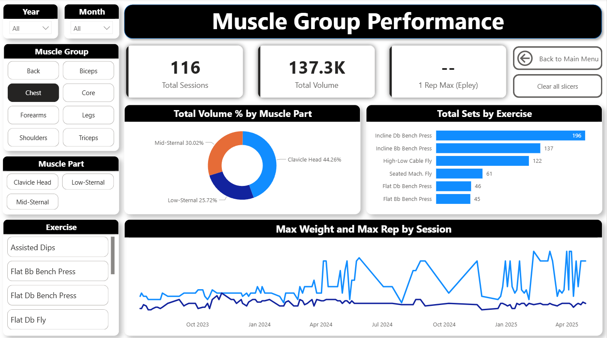

# Workout Performance & Adherence Analytics Dashboard

## Project Overview
This project is an end-to-end **fitness analytics dashboard** built using real-world workout data collected over multiple months.  
The goal of this project was to analyze **training consistency, muscle group performance, and strength progression** using proper data modeling and business intelligence practices.

Unlike guided tutorial projects, this dashboard was designed and implemented entirely from scratch — from raw data collection to final visualization.

---

## Problem Statement
Tracking workouts manually provides limited insight into:
- Training consistency over time
- Muscle group balance
- Exercise-wise workload
- Strength progression

This project aims to answer key questions:
- How consistent is the training routine?
- How many days were skipped?
- Which muscle groups receive the most focus?
- How does strength progress over time for specific exercises?

---

## Tools & Technologies
- **Python (Pandas)** – Used for data cleaning, normalization, feature creation, and preparing fact & dimension tables for analysis.
- **MySQL** – Served as the analytical database to store the star schema and perform exploratory data analysis using SQL.
- **Power BI** – Used to build interactive, multi-page dashboards with drill-downs, slicers, and navigation for storytelling.
- **DAX** – Implemented custom measures for sessions, adherence %, volume calculations, and strength estimation (Epley 1RM).
- **SQL** – Used to query, validate, and analyze workout data across fact and dimension tables.
- **Data Modeling (Star Schema)** – Designed a scalable fact–dimension model to enable efficient filtering, aggregation, and analytics.

---

## Dataset
- Source: Personal workout log
- Time Period: July 2023 – May 2024
- Size: 4,000+ rows
- Granularity: One row per **exercise set**

### Raw Data Attributes (initial):
- Date
- Exercise
- Muscle Group
- Weight
- Reps
- Distance / Time (where applicable)

---

## Data Modeling Approach
A **star schema** was designed to support efficient analysis and scalability.

### Fact Table
- `f_workouts`
  - One row per exercise set
  - Measures: reps, weight, volume

### Dimension Tables
- `d_calendar` – Date intelligence with custom date key
- `d_exercise` – Canonical exercise names
- `d_muscle_part` – Muscle parts (e.g., Lats, Upper Back)
- `d_muscle_group` – High-level muscle groups (Chest, Back, Legs, etc.)

This structure allows flexible slicing by:
- Time
- Muscle group
- Muscle part
- Exercise

---

## Data Processing & ETL
### Python (Pandas)
- Cleaned and standardized raw workout data
- Created surrogate keys for dimensions
- Normalized data into fact and dimension tables

### MySQL
- Loaded all dimension and fact tables
- Performed exploratory data analysis (EDA)
- Answered analytical questions around volume, frequency, and consistency

---

## Key Metrics & Logic
Some of the core analytical concepts implemented:
- **Workout Sessions**: Distinct workout days
- **Adherence %**: Workout days vs planned days (excluding Sundays)
- **Total Volume**: Weight × Reps
- **Strength Estimation**: Epley 1RM formula
- **Exercise Distribution**: Sets and volume by exercise and muscle group

(Custom SQL and DAX logic intentionally not shared publicly.)

---

## Power BI Dashboard
The dashboard consists of **two interactive pages**:

### 1. Workout Overview & Adherence
- Planned workout days
- Total workouts completed
- Days skipped
- Adherence percentage
- Muscle group navigation using visual selectors

  

### 2. Muscle Group Performance
- Total sessions
- Total training volume
- Estimated 1RM (Epley)
- Volume distribution by muscle part
- Sets by exercise
- Progression trends over time

  

All visuals are fully interactive and filter-driven.

---

## Key Learnings
- Designing scalable data models matters more than visuals alone
- Clean dimensions simplify complex analysis
- DAX measures should reflect business logic, not just calculations
- Good dashboards tell a story, not just show charts

---

## Future Improvements
- Add true workout session identifiers
- Include bodyweight and cardio metrics
- Automate data ingestion
- Deploy as a web-based fitness analytics app

---

## About the Author
This project was built as part of my journey into **Data Analytics**, focusing on real-world problem solving and end-to-end ownership of data projects.

Feedback and suggestions are always welcome.

[def]: Screensh